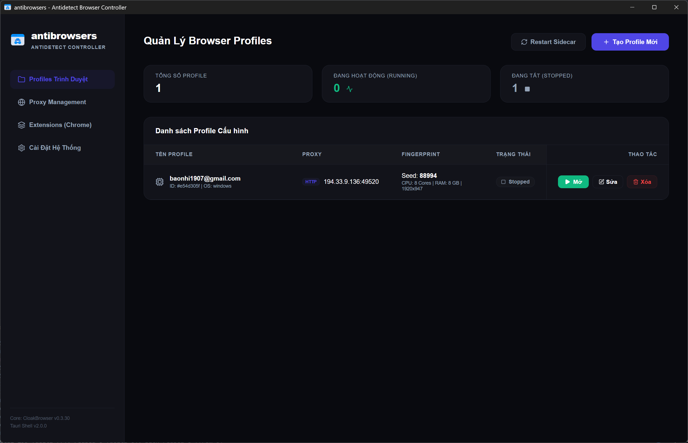

# antibrowsers - Professional Antidetect Stealth Browser Manager



**antibrowsers** is a professional antidetect browser and profile management solution. It allows you to create completely isolated browsing environments to securely manage multiple social media accounts (Facebook, Google, TikTok...), run MMO operations, Dropshipping, or manage E-commerce stores (eBay, Amazon, Etsy...) without getting flagged or linked.

---

## 🚀 Key Features

* **Profile Isolation**: Each profile features its own isolated storage (Cookies, History, Cache), completely independent of other profiles.
* **Fingerprint Emulation**: Spoofs hardware specs (CPU, RAM, screen resolution) and adds natural graphics noise (Canvas, WebGL, Audio) to prevent hardware fingerprint tracking.
* **Proxy Integration**: Supports HTTP/SOCKS5. Automatically aligns browser Timezone, Language, and GPS coordinates to match your Proxy IP.
* **Chrome Extension**: Easily load your favorite extensions by uploading them as `.zip` files.
* **Auto Core Manager**: Automatically downloads and manages the secure Chromium Stealth browser core on the first run.

---

## 📦 How to Download & Build the Executable (.exe / .msi)

Follow these instructions if you want to download the source code and build the application installer executable yourself.

### 1. Prerequisites
Ensure the following tools are installed on your computer:
* **Node.js** (LTS version recommended, v18+).
* **Rust & Cargo** (Follow instructions at [rustup.rs](https://rustup.rs/)).
* **C++ Build Tools** (Required by Tauri for compiling apps on Windows).

### 2. Build Steps
1. Download the full source code of this project to your computer and extract it.
2. Open your terminal or Command Prompt in the extracted source directory.
3. Install the required dependencies:
   ```bash
   npm install
   ```
4. Build and package the application into a Windows installer:
   ```bash
   npm run build:exe
   ```
5. Once compilation is complete, you will find the installer file (`.exe` or `.msi`) in:
   `src-tauri/target/release/bundle/`

---

## 🛠️ Quick Start Guide

1. **Launch**: Double-click the compiled installer file to install, then launch the application.
2. **Browser Core Download**: On your first launch or profile run, the app will automatically download the Chromium Stealth core (~120MB). Keep a stable internet connection until complete.
3. **Create Profile**: Click **Create New Profile**, name it, and configure your Proxy (format: `IP:Port` or `IP:Port:User:Pass`). Click **Check Connection** and then **Save**.
4. **Open Browser**: Click the **Launch** button (green Play icon) next to your profile to start browsing securely. When finished, simply close the browser window; your cookies will save automatically.

---

## ❓ FAQ

* **Where is my profile data stored?**
  * All cookies, passwords, and profile configuration files are stored locally on your own computer's hard drive. antibrowsers does not transmit this data, ensuring absolute privacy.
* **Why does the browser fail to launch when I click the "Launch" button?**
  * Please verify that the browser core download is 100% complete (you can check the status in System Settings). Also, verify if your proxy is active or try launching without a proxy to test.
