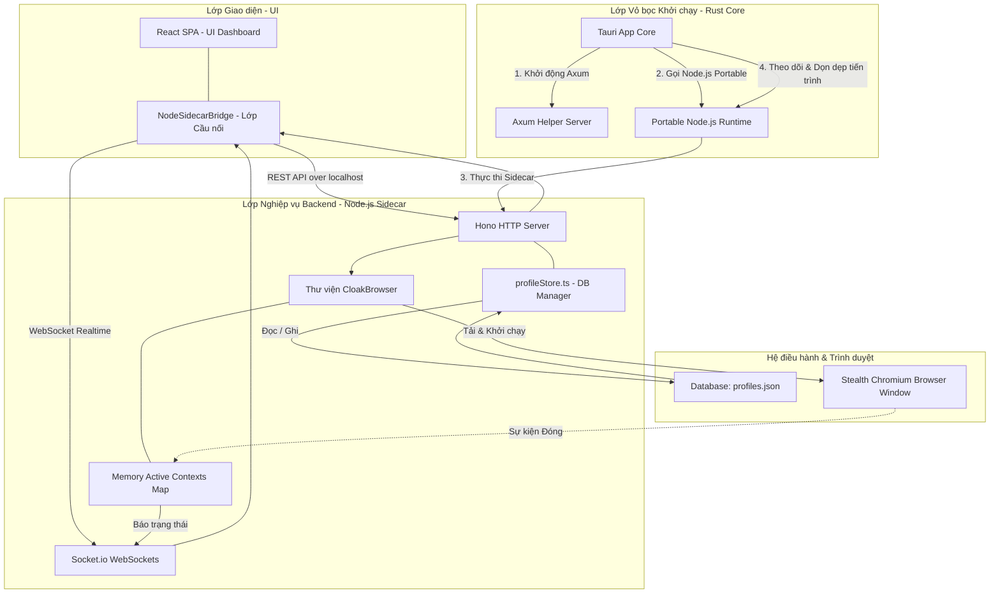

# Đặc tả Kiến trúc Hệ thống (System Architecture)

Tài liệu này mô tả chi tiết kiến trúc hệ thống 3 lớp của dự án **antibrowsers**, làm rõ ranh giới hoạt động và các kênh giao tiếp giữa chúng.

---

## 1. Tổng quan Kiến trúc 3 Lớp (3-Layer Architecture)

Dự án được xây dựng trên mô hình kết hợp giữa **Tauri v2 (Rust)** để đóng gói ứng dụng native và **Node.js Sidecar** để xử lý các logic nghiệp vụ phức tạp của trình duyệt (thông qua Playwright/CloakBrowser).

---

## 2. Chi tiết các Thành phần

### A. Lớp Giao diện (React Frontend UI)
* **Công nghệ**: React TS, Vite, Vanilla CSS (Glassmorphism & Sleek Dark theme).
* **Nhiệm vụ**: 
  - Hiển thị danh sách các profile trình duyệt antidetect, trạng thái sống/chết thời gian thực.
  - Cung cấp các form trực quan cấu hình proxy, seed, resolution, CPU/RAM, GeoIP, và humanize.
  - Kết nối và giao tiếp qua REST Client và Socket.io Client với Node.js Sidecar.

### B. Lớp Nghiệp vụ Backend (Node.js Sidecar)
* **Công nghệ**: Node.js, Hono Framework (HTTP REST), Socket.io (WebSocket), CloakBrowser SDK, Playwright Core.
* **Nhiệm vụ**:
  - **Chứa 100% logic nghiệp vụ**. Không viết logic quản lý profile ở phía Rust.
  - Quản lý database JSON cục bộ `profiles.json` tại `%APPDATA%/.tauri-antidetect-browser/`.
  - Khởi chạy và điều khiển các trình duyệt antidetect stealth bằng thư viện `cloakbrowser`.
  - Lưu giữ tham chiếu tới các trình duyệt đang chạy trong một `Map<string, BrowserContext>` cục bộ để quản lý.
  - Phát hiện trình duyệt đóng thủ công nhờ sự kiện `context.on('close')`, tự động cập nhật trạng thái sang `Stopped` và đẩy thông báo tức thời về UI qua Socket.io.

### C. Lớp Vỏ bọc Khởi chạy (Tauri v2 Rust Core)
* **Công nghệ**: Rust, Tauri v2.
* **Nhiệm vụ**:
  - **Mức tối giản tối đa (Thin Shell)**. Không chứa logic nghiệp vụ.
  - Khởi động một server Axum nội bộ để tạo cổng giao tiếp.
  - Chuẩn bị môi trường Node.js Portable (di động) tự động tải về hoặc tích hợp sẵn.
  - Khởi chạy tiến trình Node.js Sidecar bằng `tauri-plugin-shell` và truyền port của Axum server qua tham số `--tauri-port`.
  - Đóng và dọn dẹp sạch sẽ toàn bộ các tiến trình Node.js Sidecar và Chromium liên quan khi ứng dụng chính bị tắt (ExitRequested) để đảm bảo không rò rỉ tiến trình chạy ngầm.

---

## 3. Luồng Giao tiếp & Dữ liệu

### A. Luồng Khởi động (Boot Sequence)
1. Tauri app mở ra -> Rust Core khởi động Axum server phụ để lấy một port trống ngẫu nhiên.
2. Rust Core kiểm tra/tải runtime Node.js di động.
3. Rust Core khởi chạy Node.js Sidecar bằng lệnh: `node.exe server.cjs --tauri-port=PORT_AXUM`.
4. Sidecar Hono khởi động thành công ở một port ngẫu nhiên của nó, gửi một request `PUT http://127.0.0.1:PORT_AXUM/api/sidecar/ready` để đăng ký port của mình với Rust.
5. Rust Core nhận port và đẩy sự kiện `sidecar:ready` lên Frontend.
6. Frontend lấy được port của Hono Server và thiết lập kết nối REST API / Socket.io trực tiếp tới Hono Sidecar.

### B. Luồng Khởi chạy / Đóng Profile
* Xem chi tiết trong [docs/API_DOCUMENTATION.md](API_DOCUMENTATION.md) và [docs/CLOAKBROWSER_INTEGRATION.md](CLOAKBROWSER_INTEGRATION.md).
