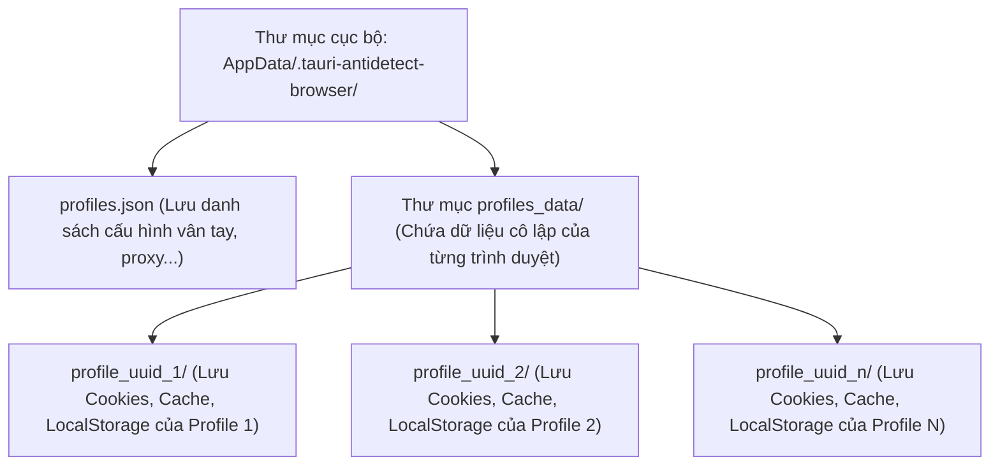

# Cấu trúc Dữ liệu & Lưu trữ (Data Structure)

Tài liệu này đặc tả chi tiết cấu trúc dữ liệu cấu hình profile và cách tổ chức thư mục lưu trữ cô lập dữ liệu trình duyệt cục bộ của **antibrowsers**.

---

## 1. Bản đồ Lưu trữ File (Directory Map)

Mọi dữ liệu của ứng dụng được cô lập an toàn bên trong thư mục người dùng (`User Home`) để đảm bảo không bị mất khi ứng dụng Tauri được cập nhật hoặc cài đặt lại:



* **Windows**: `C:\Users\USERNAME\.tauri-antidetect-browser\`
* **macOS / Linux**: `~/.tauri-antidetect-browser/`

---

## 2. Đặc tả Schema Profile (TypeScript Interface)

Mỗi profile trong cơ sở dữ liệu `profiles.json` được định nghĩa theo cấu trúc TypeScript sau:

```typescript
export interface BrowserProfile {
  // --- Định danh & Quản lý ---
  id: string;              // UUID ngẫu nhiên duy nhất
  name: string;            // Tên gợi nhớ do người dùng đặt
  createdAt: number;       // Epoch timestamp lúc tạo
  
  // --- Giả lập Hệ điều hành ---
  platform: 'windows' | 'macos'; // Giả lập OS
  
  // --- Mạng & Proxy ---
  proxyType: 'none' | 'http' | 'socks5';
  proxyHost: string;       // IP hoặc tên miền Proxy
  proxyPort: number;       // Cổng kết nối Proxy
  proxyUsername?: string;  // Tài khoản Proxy (nếu có)
  proxyPassword?: string;  // Mật khẩu Proxy (nếu có)
  webrtc: 'auto' | 'default' | string; // Ghi đè IP WebRTC
  
  // --- Giả lập Vân tay Trình duyệt (Stealth Fingerprint) ---
  seed: string;            // Hạt giống vân tay tĩnh (10000 - 99999)
  cpuCores: number;        // navigator.hardwareConcurrency (2, 4, 8, 12, 16)
  deviceMemory: number;    // navigator.deviceMemory (2, 4, 8, 16) (GB)
  viewportWidth: number;   // Chiều rộng màn hình giả lập
  viewportHeight: number;  // Chiều cao màn hình giả lập
  storageQuota?: number;   // Hạn ngạch bộ nhớ cache giả lập (MB)
  
  // --- Bản xứ hóa ---
  timezone: 'auto' | string; // Múi giờ IANA hoặc 'auto' (GeoIP)
  locale: 'auto' | string;   // Ngôn ngữ Locale hoặc 'auto' (GeoIP)
  
  // --- Giả lập hành vi ---
  humanize: boolean;       // Bật/tắt mô phỏng hành vi người thật
  humanPreset: 'default' | 'careful';
  
  // --- Tiện ích ---
  extensionPaths?: string[]; // Mảng chứa các đường dẫn extension cục bộ
}
```

---

## 3. Cơ chế Cô lập Cache Trình duyệt (Storage Isolation)

* Khi CloakBrowser được gọi qua `launchPersistentContext`, thư mục `userDataDir` sẽ được trỏ tới `profiles_data/UUID_PROFILE/`.
* Trình duyệt Chromium Stealth sẽ tự động tạo cấu trúc profile Chrome chuẩn bên trong thư mục này (gồm `Default/Cookies`, `Default/Local Storage`, `Default/Cache`, `IndexedDB`, `Service Workers`...).
* Điều này giúp **cô lập hoàn toàn các phiên làm việc**:
  - Không bao giờ bị rò rỉ cookie hay chéo session giữa các profile.
  - Mỗi profile hoạt động như một máy tính độc lập hoàn toàn ở một địa điểm vật lý khác nhau.
  - Toàn bộ trạng thái đăng nhập tài khoản được lưu trữ an toàn và khôi phục nguyên vẹn ở lần mở tiếp theo.
